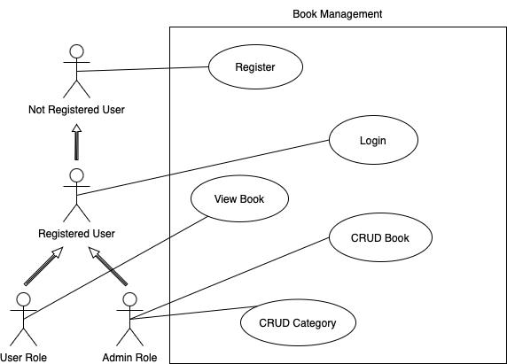

# 📚 Book API Golang
> 💡 _Catatan: Repositori ini dikelola oleh saya sendiri menggunakan dua akun GitHub — [`johannessipayung`](https://github.com/johannessipayung) sebagai akun utama dan [`SheraCode`](https://github.com/SheraCode) sebagai akun eksperimen/pengujian._


## 📝 Deskripsi
Project ini adalah aplikasi backend untuk manajemen buku dengan fitur login dan register menggunakan JWT. Pengguna dapat menambahkan, mengedit, dan menghapus buku. Sistem ini menggunakan Golang dengan framework Gin, database PostgreSQL, dan pola layering agar kode terstruktur, aman, dan mudah dikembangkan.

## Use Case Diagram
Berikut adalah use case diagram yang menggambarkan fungsi utama dari aplikasi Book Management ini:



## 🔗 Relasi Antar Tabel

Project ini menggunakan tiga entitas utama yaitu **User**, **Category**, dan **Book** dengan relasi sebagai berikut:

- 👤 **User** dan 📚 **Book** memiliki relasi **One-to-Many**, artinya satu user dapat memiliki banyak buku, tetapi satu buku hanya dimiliki oleh satu user. Ini direpresentasikan dengan adanya `UserID` sebagai foreign key pada tabel `books`.  
  Contohnya, seorang user bisa menambahkan beberapa buku ke koleksinya, tapi setiap buku hanya tercatat sebagai milik satu user.

- 🗂️ **Category** dan 📚 **Book** juga memiliki relasi **One-to-Many**, dimana satu kategori bisa memiliki banyak buku, namun satu buku hanya masuk ke dalam satu kategori tertentu.  
  Hal ini diwujudkan dengan `CategoryID` sebagai foreign key pada tabel `books`. Misalnya, kategori "Fiksi" bisa berisi banyak buku, tetapi satu buku hanya dapat dikategorikan sebagai "Fiksi" saja.

Dengan struktur relasi ini, aplikasi dapat mengelola data buku secara terorganisir berdasarkan siapa pemiliknya dan kategori buku tersebut, sekaligus menjaga integritas data dengan menggunakan foreign key.

✨ Secara garis besar, relasi ini memastikan:

- 📋 Data user terhubung dengan buku yang dimilikinya  
- 🏷️ Buku dapat diklasifikasikan ke dalam kategori tertentu  
- 🔍 Memudahkan dalam query data seperti mengambil semua buku milik user tertentu atau semua buku dalam kategori tertentu

## 🧱 Project Structure & Pattern Explanation

Project ini menggunakan **Layering Pattern** (Layered Architecture) yang membagi aplikasi menjadi beberapa lapisan dengan tanggung jawab berbeda. Tujuan penggunaan pattern ini adalah untuk:

- ⚙️ Memisahkan concerns (separation of concerns) agar tiap lapisan fokus pada fungsinya
- 🛠️ Meningkatkan maintainability sehingga kode mudah dipahami, dikembangkan, dan diperbaiki
- 🧩 Mendukung modularitas agar tiap layer bisa dikembangkan dan diuji secara independen
- 🧪 Memudahkan testing karena boundary antar layer jelas
- 👥 Mempermudah kolaborasi dalam tim
- 🚀 Mendukung skalabilitas aplikasi di masa depan

### 🗂️ Struktur Layer:
- `handler/` → 📥 Menerima HTTP request dan memberikan response (Controller)
- `service/` → 🧠 Menangani business logic dan validasi
- `repository/` → 🗃️ Berinteraksi langsung dengan database (CRUD operation)
- `model/` → 🧾 Struktur data (entities/DTO)
- `middleware/` → 🛡️ Middleware seperti JWT authentication, logging, dll
- `config/` → ⚙️ Konfigurasi dan setup koneksi database
- `router/` → 🌐 Setup routing endpoint menggunakan Gin

### ✅ Alasan Penggunaan Pattern:
- 🔍 Memudahkan testing karena tiap layer dapat diuji secara terpisah
- 🧱 Code lebih modular dan mudah dikelola
- 🏗️ Cocok untuk proyek skala menengah hingga besar
- 🧼 Penerapan praktik clean architecture

## 🧪 Testing

- ✅ Menggunakan `testify` untuk assertion dan mocking
- 🧾 Disediakan E2E test di `e2e/login_test.go` untuk memastikan alur login berjalan sesuai harapan

## 🧭 Arsitektur

Menggunakan **Layered Architecture Pattern** agar kode terstruktur dengan baik dan tanggung jawab dipisah antar lapisan:

- `handler/` → 📥 Mengelola input/output data dari dan ke client (sebagai controller)
- `service/` → 🧠 Menangani logika bisnis utama
- `repository/` → 💾 Bertanggung jawab untuk komunikasi langsung dengan database menggunakan GORM
- `model/` → 🧾 Representasi struktur data dan entitas (seperti User dan Book)
- `config/` → ⚙️ Konfigurasi aplikasi seperti koneksi ke database dan environment setup
- `middleware/` → 🛡️ Middleware khusus seperti autentikasi JWT yang memfilter request sebelum sampai ke handler
- `e2e/` → 🧪 Pengujian End-to-End untuk memastikan alur sistem bekerja sebagaimana mestinya
- `test/` → 🔬 Unit test untuk masing-masing komponen seperti service atau repository, agar fungsionalitas dapat diuji secara terisolasi

## 🔧 Teknologi
- 🚀 Gin (Web Framework)
- 🛠️ GORM (ORM)
- 🐘 PostgreSQL
- 🔐 JWT untuk autentikasi
- 📬 Postman untuk dokumentasi dan testing API

## ▶️ Jalankan
```bash
go run main.go
```

## 🧪 E2E Test
```bash
go test ./e2e
```

## 📬 Dokumentasi

Dokumentasi lengkap API ini tersedia secara publik di Postman dan dapat diakses melalui link berikut:

🔗 [Lihat Dokumentasi API di Postman](https://documenter.getpostman.com/view/27541471/2sB2qcBzvp)


## 🌱 Pengembangan Selanjutnya (Opsional)
Penggunaan DTO (Data Transfer Object) secara konsisten untuk memisahkan model domain dengan data yang dikirim dan diterima lewat API, sehingga menjaga keamanan dan fleksibilitas data yang diproses di tiap layer
## 👨‍💻 Author

- Johannes Bastian Jasa Sipayung ([@johannessipayung](https://github.com/johannessipayung))  
  *Kontributor lain: [@SheraCode](https://github.com/SheraCode) adalah akun saya juga.*
